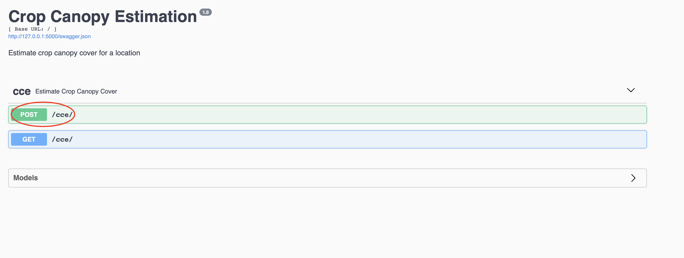
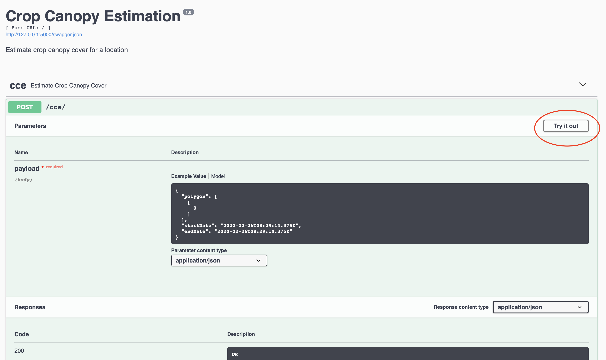
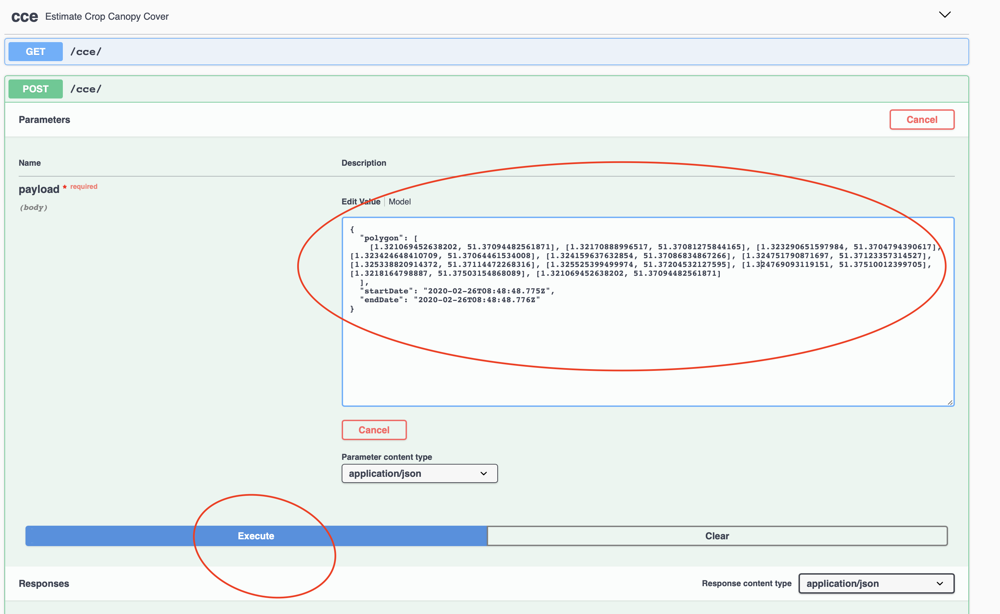

# crop-canopy-estimation
Hotel group for Cambridge Part IB 2019-20 Group Project

## How to Run

First, ensure you are in crop-canopy-estimation directory in Terminal/Command Prompt, then run the following to set up:

```bash
python3 -m virtualenv venv
source venv/bin/activate
pip3 install -r requirements.txt
earthengine authenticate
# follow the instructions given for authentication of earthengine
```

You are ready to run everything now, so do this:

```bash
FLASK_APP=app.py flask run
```
You will see something like:

```bash
 * Serving Flask app "app.py"
 * Environment: production
   WARNING: This is a development server. Do not use it in a production deployment.
   Use a production WSGI server instead.
 * Debug mode: off
 * Running on http://127.0.0.1:5000/ (Press CTRL+C to quit)
```

Go to the link in your browser where you will be presented with this page. Click `cce`


You'll see this, click the POST request

Click `Try It Out`

Fill in the coordinates for the polygon like so, and then click execute. If everything works, you'll see the result below (scroll down, under `responses`)

