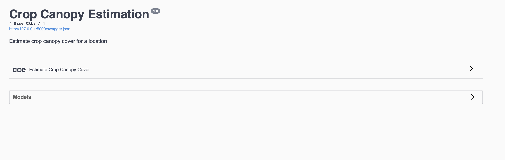

# crop-canopy-estimation
Hotel group for Cambridge Part IB 2019-20 Group Project

## How to Run

First, ensure you are in crop-canopy-estimation directory in Terminal/Command Prompt.

Check that you don't have any spaces in your filepath by running this

```bash
pwd | grep " "
```

If you see the current working directory is printed then there is a space in your filepath. Change that to an underscore and try running the command again until there is nothing printed.

After this is done, run the following to set up:

```bash
pip3 install virtualenv
python3 -m virtualenv venv
source venv/bin/activate
pip3 install -r requirements.txt
earthengine authenticate
# follow the instructions given for authentication of earthengine
```

Also, check that you have this file `model_mixed_avg`:

```bash
find model_mixed_avg
```
If you don't see an error, you're good to go and are ready to run everything now, so do this to run (deploy) the model API locally:

```bash
FLASK_APP=app.py flask run
```
You will see something like:

```bash
 * Serving Flask app "app.py"
 * Environment: production
   WARNING: This is a development server. Do not use it in a production deployment.
   Use a production WSGI server instead.
 * Debug mode: off
 * Running on http://127.0.0.1:5000/ (Press CTRL+C to quit)
```

Go to the link in your browser where you will be presented with this page. Click `cce`


You'll see this, click the POST request

Click `Try It Out`

Fill in the coordinates for the polygon like so, and then click execute. If everything works, you'll see the result below (scroll down, under `responses`)

## API Example
Example query:
```JSON
{
  "polygon": [[-0.6002178689932902, 54.20795316920642], [-0.5971676809046156, 54.20799290015759], [-0.5939706702489467, 54.20768898360229], [-0.5935753084855988, 54.20698203033187], [-0.5909770447734153, 54.20707444856532], [-0.5911351433266643, 54.20771533534042], [-0.5910786038715266, 54.20827692633146], [-0.5926374989602323, 54.20982299833632], [-0.593100706812677, 54.209618192874], [-0.5940722517049934, 54.21038461137967], [-0.597359836966348, 54.21034496345343], [-0.597472803204202, 54.21016657428093], [-0.5995402307101838, 54.20988242710103], [-0.6005117954784611, 54.20963793456319], [-0.6005456853750302, 54.20961811227437], [-0.6011555409214331, 54.20799937387915], [-0.6002178689932902, 54.20795316920642]],
  "startDate": "2019-05-01",
  "endDate": "2019-09-15"
}
```
Example response:
```JSON
{
  "status": "OK",
  "dates": [
    "2019-05-03T17:49:43",
    ...
    "2019-09-14T06:21:47"
  ],
  "ndvi": [
    0.15078306657106164,
    ...
    0.17635408609086783
  ]
}
```